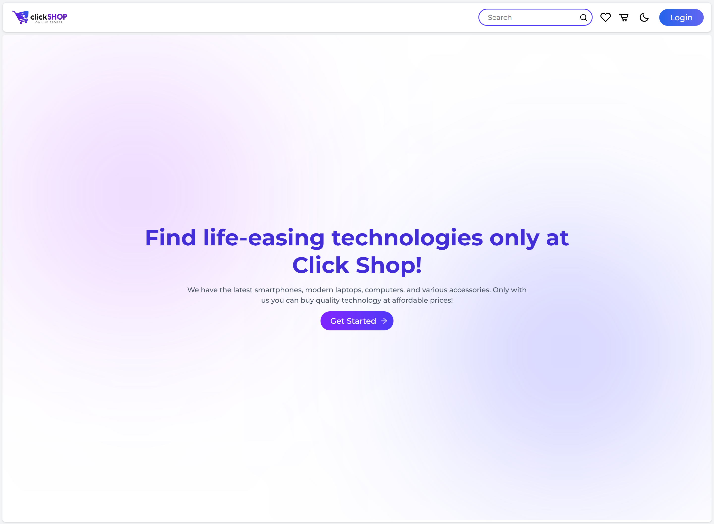
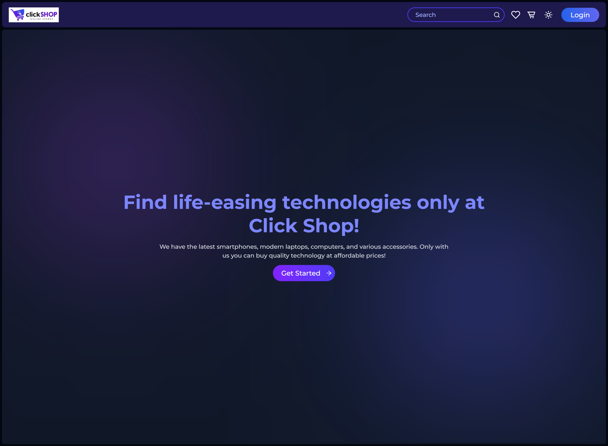
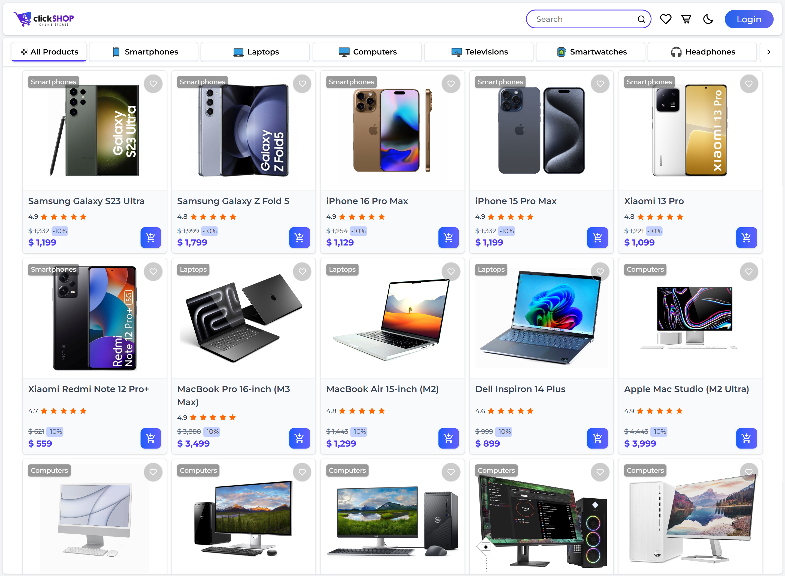
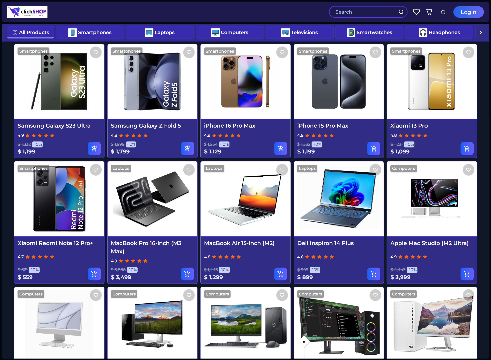
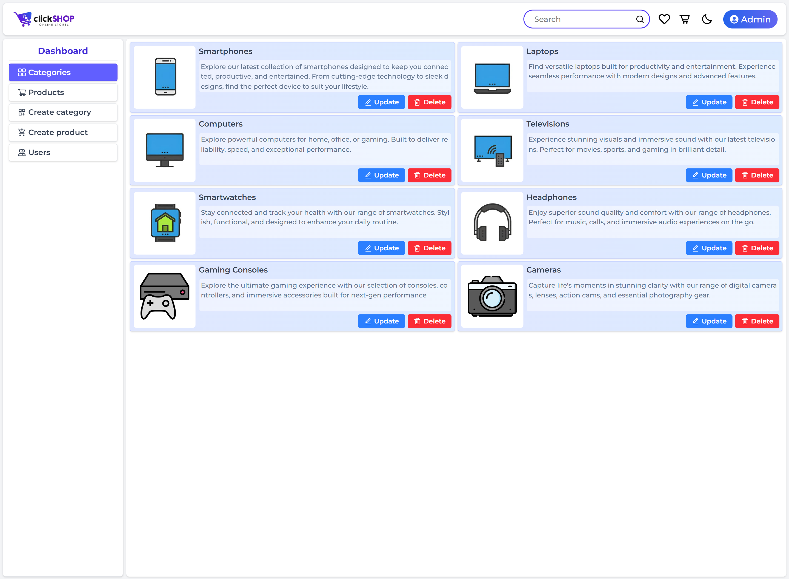
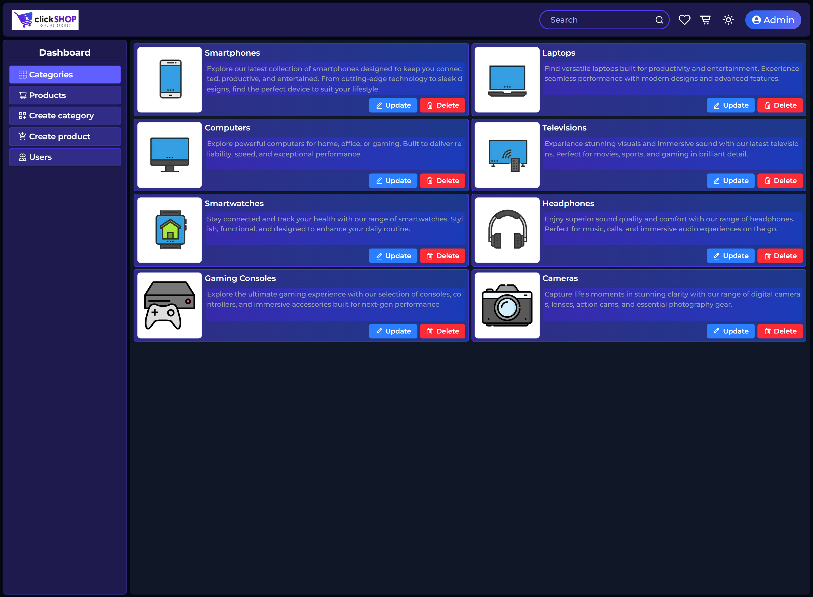

# 🛍️ ClickShop


A small e-commerce web app built to learn **Redux Toolkit** (with RTK Query) and the **Feature-Sliced Design (FSD)** architecture.

I am a beginner front-end developer. This project is not perfect or fully finished — I built it feature by feature while learning. I used AI assistance (Claude) to help me understand concepts and debug, but I wrote and typed every line myself and tried to understand what each part does.

## ✨ Features

- 🛒 Browse products by category, with a category swiper
- 🔍 Search with live autocomplete
- 📄 Product detail page with Amazon-style hover zoom on the image
- ❤️ Add to favorites, add to cart, with quantity and totals
- 🔐 Login / register with validation (Zod + React Hook Form)
- 🌙 Dark mode, saved across visits
- 🎬 Page and scroll animations (Motion, Intersection Observer)
- 🛠️ Admin panel (admin accounts only):
  - Create / delete products
  - Create / delete categories
  - View users and their orders

## 📸 Preview

| | |
|---|---|
|  |  |
|  |  |
|  |  |

## 🔗 Live Demo

[Visit Live](https://farhad-deve.github.io/click-shop/) 

## 🚀 Getting Started

Clone the repository:

```bash
git clone https://github.com/your-username/your-repo-name.git
```

Install dependencies:

```bash
npm install
```

Run the development server:

```bash
npm run dev
```

Build for production:

```bash
npm run build
```

## 🧱 Project Structure

This project follows **Feature-Sliced Design (FSD)**:

```
src/
├── app/         → store, routes, providers
├── pages/       → route pages
├── widgets/     → bigger UI blocks (Header, Sidebar, ProductGrid, etc.)
├── features/    → user actions (add-to-cart, auth, add-to-favorite, etc.)
├── entities/    → data and business logic (product, category, cart, user)
└── shared/      → reusable UI, hooks, and utils
```

## 📝 Notes

This project is still a work in progress. Some features may be missing or not fully polished. My main goal was to practice Redux Toolkit and to understand a real project structure (FSD), not to build a perfect final product.
